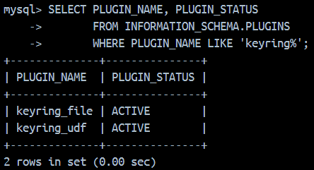
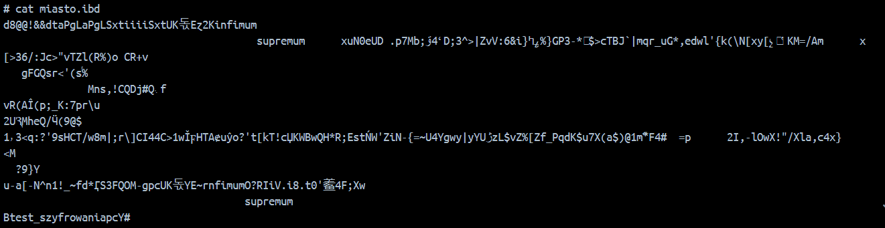

Projekt aplikacji do zamieszczania ogłoszeń rzeczy do oddania.

---

## 📋 Wymagania

### Backend

Aby uruchomić backend, zainstaluj wymagane zależności za pomocą poniższych komend:

```bash
pip install flask
pip install flask-cors
pip install mysql-connector-python
pip install python-dotenv
pip install bcrypt
pip install PyJWT
```

## Baza danych

Baza danych działa w systemie Source-Replica. Połączenie jest szyfrowane. Dane w bazie są szyfrowane metodą data at rest encryption.



Przed:


Po:


### Frontend

W terminalu projektu frontendowego uruchom instalację zależności:

```bash
npm install
```

---

## 🛠️ Jak to działa?

### Uruchamianie projektu

1. **Uruchom bazę danych**

   ```bash
   cd .\backend\database\
   .\start_database.bat
   ```

   1.1 **Łączenie z bazą z SQLTools**

   Jeśli używasz rozszerzenia SQLTools w VSCode dodaj to do .vscode/settings.json:

   ```json
   "sqltools.connections": [
   {
      "mysqlOptions": {
         "authProtocol": "default",
         "enableSsl": "Enabled",
         "ssl": {
            "ca": "./backend/database/certs/server/ca.pem",
            "cert": "./backend/database/certs/server/server-cert.pem",
            "key": "./backend/database/certs/server/server-key.pem"
         }
      },
      "previewLimit": 50,
      "server": "localhost",
      "port": 3306,
      "driver": "MySQL",
      "name": "Master",
      "password": "jfi532AFn13oiAA5Fom5A332AF",
      "username": "write_user",
      "database": "SmieciarkaJedzie",
      "connectionTimeout": 50
   },
   {
      "mysqlOptions": {
         "authProtocol": "default",
         "enableSsl": "Enabled",
         "ssl": {
            "ca": "./backend/database/certs/client/ca.pem",
            "cert": "./backend/database/certs/client/client-cert.pem",
            "key": "./backend/database/certs/client/client-key.pem"
         }
      },
      "previewLimit": 50,
      "server": "localhost",
      "port": 3307,
      "driver": "MySQL",
      "name": "Slave",
      "database": "SmieciarkaJedzie",
      "username": "read_user",
      "password": "aoA34ginGI4OAA3PO134GgAPF135OK",
      "connectionTimeout": 50
   }
   ]
   ```

2. **Uruchom backend**:

   ```bash
   python .\backend\app.py
   ```

3. **Uruchom frontend**:
   ```bash
   cd .\frontend
   npm run dev
   ```

### Funkcjonalności aplikacji

- **Przeglądanie produktów**  
  Na stronie **Kolekcje** możesz przeglądać dostępne produkty oraz sortować je według preferencji.

- **Dodawanie produktu**  
  Aby dodać produkt, musisz być zalogowany:

  1. Kliknij ikonę użytkownika (w prawym górnym rogu) i utwórz konto, podając dane użytkownika **oraz URL do zdjęcia profilowego**.  
     Przykładowy URL:  
     [https://i.insider.com/6220a714d72a25001973dae4?width=700](https://i.insider.com/6220a714d72a25001973dae4?width=700)
  2. Po zalogowaniu kliknij ikonę **+** (Dodaj Produkt).
  3. Wypełnij wszystkie wymagane pola, w tym URL zdjęcia produktu.  
     Przykładowy URL:  
     [https://www.northweststar.com.au/images/transform/v1/crop/frm/silverstone-feed-data/eaf7e80c-576f-4392-b80b-4dbe88edea4c.jpeg/r0_0_1280_854_w1200_h678_fmax.jpg](https://www.northweststar.com.au/images/transform/v1/crop/frm/silverstone-feed-data/eaf7e80c-576f-4392-b80b-4dbe88edea4c.jpeg/r0_0_1280_854_w1200_h678_fmax.jpg)
  4. Kliknij **Dodaj Produkt**. Po sukcesie pojawi się powiadomienie typu "toast".  
     Odśwież stronę Kolekcje, aby zobaczyć nowy produkt.

- **Koszyk (Trash)**  
  W zakładce **Koszyk** możesz:
  - Usuwać produkty.
  - Modyfikować datę graniczną odbioru.

---

## 👨‍💻 Autorzy

Projekt został stworzony przez:

- **Jakub Stankiewicz**  
  **Nr indeksu:** 272264  
  **GitHub:** [JakubStankiewicz1](https://github.com/JakubStankiewicz1)

- **Jakub Szczepański**  
  **Nr indeksu:** 272280  
  **GitHub:** [pepan-7](https://github.com/pepan-7)

---

## 📜 Licencja

Ten projekt jest licencjonowany na podstawie wybranej licencji. Szczegóły znajdziesz w pliku [LICENSE](<[LICENSE](https://github.com/pepan-7/SmieciarkaJedzie?tab=License-1-ov-file)>).

---

## ❓ Kontakt

Jeśli masz jakiekolwiek pytania lub sugestie, zapraszamy do kontaktu za pomocą sekcji [Issues](https://github.com/uzytkownik/nazwa-projektu/issues) na GitHub.
